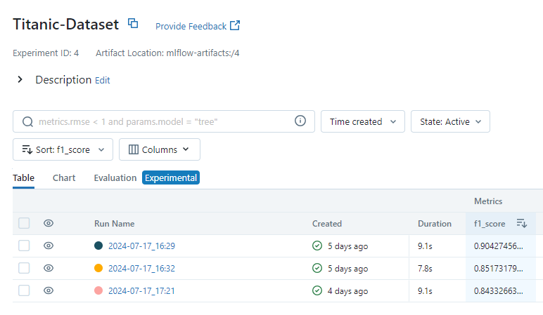
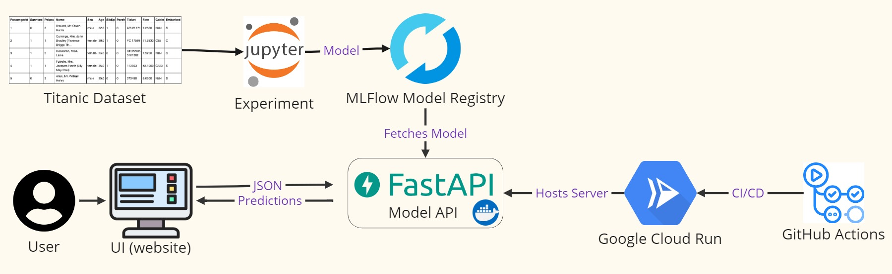
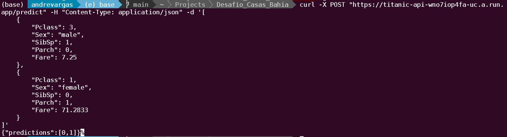
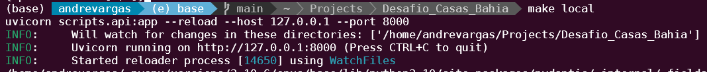

# Desafio API Titanic - Grupo Casas Bahia

## 1. Introdução:

Este repositório contém uma API desenvolvida em FastAPI para prever a sobrevivência de passageiros do Titanic. O modelo de Machine Learning utilizado foi treinado com o conjunto de dados do Titanic e armazenado em um servidor MLFlow. 

A API aceita dados de entrada no formato JSON, valida, processa e retorna previsões de sobrevivência.

## 2. Estrutura do Repositório:

```
Desafio_Casas_Bahia                         # Diretório raiz do projeto.
├── .github/workflows
│   └── deploy_cloud_run.yml                # Arquivo yml para CI/CD (testes unitários + deploy no GCP)
|   
├── config_mlflow/
│   └── params.yml                          # Arquivo de configuração com parâmetros do modelo
|                  
├── data/                                   # Dados do projeto
│   └── 1. raw/                             
│       └── test.csv                        # CSV com dados de teste
│       └── train.csv                       # CSV com dados de treino
|
├── imagens/                                # Imagens utilizadas no repositório
|
├── notebooks/                              # Diretório para notebooks Jupyter
│   └── titanic-machine-learning.ipynb      # Notebook Jupyter para análise e experimentação do modelo
│
├── scripts/                                # Diretório contendo scripts principais do projeto
│   └── api.py                              # Script da API
|
├── tests/                                  # Diretório para testes unitários
│   └── test_api.py                         # Testes unitários para a API
│   └── test_mlflow.py                      # Testes unitários para integração com MLFlow
|
├── .gitignore                              # Arquivo para especificar quais arquivos e diretórios devem ser ignorados pelo Git
├── .pylintrc                               # Configuração para o Pylint
├── Dockerfile                              # Arquivo para criação da imagem Docker
├── Makefile                                # Arquivo para automação de tarefas
├── README.md                               # Documentação do projeto
├── requirements.txt                        # Dependências do projeto
```

## 3. Desenvolvimento:

Utilizei como base o Jupyter Notebook "titanic-machine-learning.ipynb", de autoria de Muhammad Abdullah Abrar, simulando um Cientista de Dados desenvolvendo e experimentando um modelo que está pronto para ser colocado em produção. Ao final do notebook, loguei alguns experimentos em meu server de MLFlow pessoal, que pode ser acessado em [https://mlflow-server-wno7iop4fa-uc.a.run.app/](https://mlflow-server-wno7iop4fa-uc.a.run.app/).

Após alguns experimentos, foi decidido colocar em produção o modelo com F1 Score de 90%.



Os inputs desse modelo são:

- Pclass: Numérico -> Classe do navio (1, 2, 3). Representa a classe socioeconômica do passageiro onde 1 é a primeira classe, 2 é a segunda classe e 3 é a terceira classe.
- Sex: String -> Sexo do passageiro ("male" ou "female"). Representa o gênero do passageiro.
- SibSp: Numérico -> Número de irmãos/esposos a bordo. Indica quantos irmãos ou cônjuges o passageiro tinha no navio.
- Parch: Numérico -> Número de pais/filhos a bordo. Indica quantos pais ou filhos o passageiro tinha no navio.
- Fare: Numérico -> Tarifa paga pelo ticket. Representa a quantia de dinheiro que o passageiro pagou pelo bilhete.

Em cima disso, foi desenvolvida uma API com o objetivo de gerar dois endpoints:

- /predict: Aceita dados no formato JSON, valida, processa e retorna as previsões.
- /metadata: Retorna os metadados do modelo carregado, incluindo nome, estágio, tags, parâmetros e métricas.

Essa API está em produção com CI/CD realizando um deploy automático após testes unitários no meu GCP pessoal.

## 4. Arquitetura:



## 5. Teste da API:

A API pode ser testada da seguinte maneira:

- 1) Usar ferramentas como curl ou Postman para enviar uma solicitação POST ao endpoint /predict da API. Exemplo:

```
curl -X POST "https://titanic-api-wno7iop4fa-uc.a.run.app/predict" -H "Content-Type: application/json" -d '[
    {
        "Pclass": 3,
        "Sex": "male",
        "SibSp": 1,
        "Parch": 0,
        "Fare": 7.25
    },
    {
        "Pclass": 1,
        "Sex": "female",
        "SibSp": 0,
        "Parch": 1,
        "Fare": 71.2833
    }
]'
```



- 2) É possível rodar a API localmente utilizando o Makefile e, em seguida, enviar uma solicitação para o localhost. Baixe o repositório e execute os seguintes comandos:

```
make install
make local
```

Após iniciar a API, você pode usar curl ou Postman para enviar uma solicitação para http://127.0.0.1:8000/predict da mesma forma que descrito no passo 1.



- 3) Aplicação dedicada: Você pode acessar a aplicação dedicada que está hospedada [https://andrevargas.com.br/titanic_api](https://andrevargas.com.br/titanic_api). Essa aplicação fornece uma interface gráfica para carregar um arquivo CSV, visualizar os dados e obter previsões diretamente da API. Uma sugestão é subir o csv "test.csv", que está dentro da pasta "data/1. raw", para ver os resultados no dataset de teste do Titanic.
